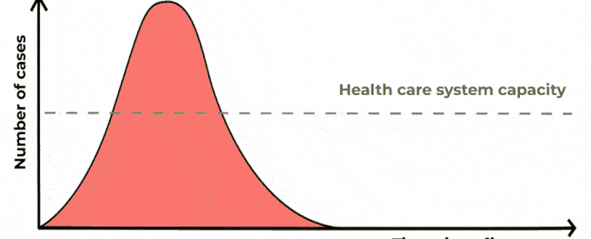
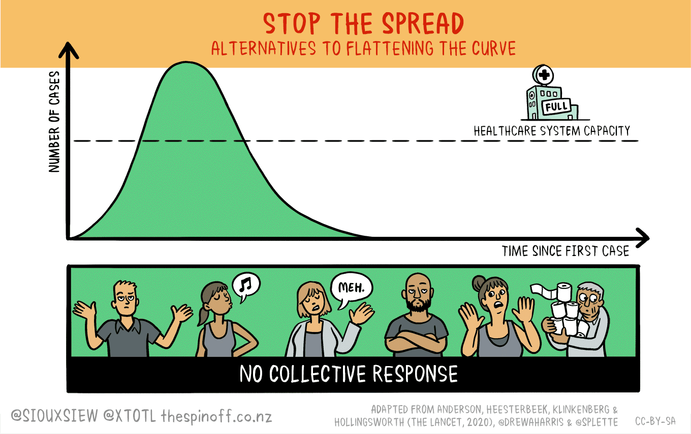
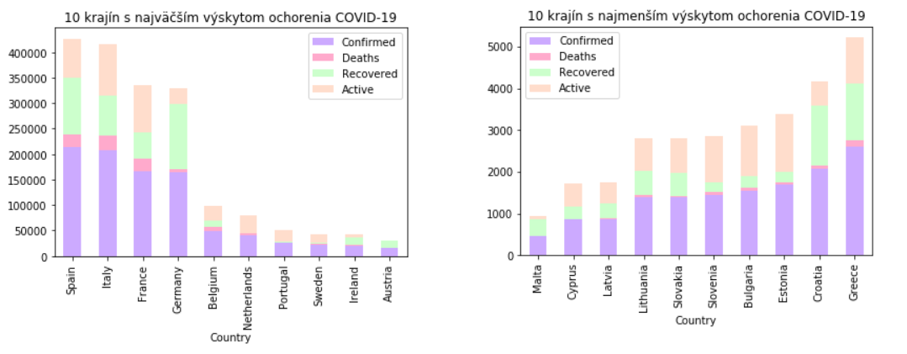

# NEURAL NETWORK for COVID-19
  > **Note:** This repository is written in *slovak* language.

### *What is Covid 19?*

Coronavirus disease (**COVID-19**) is an *infectious disease* caused by a newly discovered coronavirus.
Most people who fall sick with COVID-19 will experience mild to moderate symptoms and recover without special treatment.

### *How does it spreads?*

The virus that causes *COVID-19* is mainly transmitted through **droplets** generated when an infected person coughs, sneezes, or exhales. These droplets are too heavy to hang in the air, and quickly fall on floors or surfaces.

You can be infected by breathing in the virus if you are within close proximity of someone who has COVID-19, or by touching a contaminated surface and then your *eyes*, *nose* or *mouth*.

  > The virus caused a big pandemia, which started in China, in whe end of the year 2019. In the beggining of 2020 COVID-19 started spreading the whole world rapidly fast. See the map below.
  

<p align="right"><sup><strong>Image <a href="https://commons.wikimedia.org/wiki/File:COVID-19-outbreak-timeline.gif" target="_blank">source</a>.</strong></sup></p>

### *How to protect yourself?*
- *wash* your *hands* often 👏🧼
- maintain a *safe distance* from anyone who is *coughing* or *sneezing* 🤧
- wear *face mask* in public 😷
- stay *home* if you feel unwell 🤒

### *Health care*
***What happens when you get the coronavirus disease?***

People with COVID-19 generally develop signs and symptoms, including mild respiratory symptoms and fever, on an average of 5-6 days after infection (mean incubation period **5**-**6** days, range **1**-**14** days). Most people infected with COVID-19 virus have mild disease and recover.

***Recovery***

Using available preliminary data, the median time from onset to clinical recovery for mild cases is approximately 2 weeks and is 3-6 weeks for patients with severe or critical disease.

## *But what happens, if a lot of people get sick?*


If you look at the image above, you can see *two* curves. The tall, skinny curve is **bad** – it means that a lot of people will get sick at once, in a short period of time because we don’t take enough steps to prevent the virus from spreading from person to person.

Most people won’t get sick enough to need a hospital. But those who do could overwhelm the number of beds and care teams that our nation’s hospitals have available.

***Another key factor to consider:*** the doctors, nurses, pharmacists, technicians and many other staff who actually work in healthcare. The more cases of COVID-19 there are at any given time, the more likely some of them are to catch it, whether in the community or at work. Once they’re sick, they need to stay away from patients for weeks. Which means fewer people to take care of the patients who need care.

### *What we should do?*



### *Or...*
Help flatten the Coronavirus curve by self-isolating!

Think twice, do you really need to go outside?

  

The points that I mentions before like *washing your hands*, *covering* your nose and mouth when you *cough* or *sneez*e and *staying home* if you’re not feeling well all help slow the spread of the new coronavirus (COVID-19).

**Keep strong world! Stay safe.**

### Famous quotes „“
---
  

  > *"And then I see the disinfectant where it knocks it out in a minute. One minute. And is there a way we can do something like that, by injection inside or almost a cleaning? So it'd be interesting to check that."*
  
  > **Donald J. Trump,** ***24.4.2020***
  
  <p align="right"><sup><strong>Image <a href="https://dribbble.com/shots/5567286-US-President-Donald-Trump-vector-portrait" target="_blank">source</a>.</strong></sup></p>

 ---
 

  > *"So what? What do you want me to do? My name's Messiah but I can't work miracles."*
  
  > **Jair Messias Bolsonaro,** ***29.4.2020***
  
  <br>
  <p align="right"><sup><strong>Image <a href="https://www.shutterstock.com/image-vector/west-nusa-tenggara-indonesia-april-09-1698476086" target="_blank">source</a>.</strong></sup></p>
  
---
  

  > *"Zítra jdou děti do školy. Bylo by dobré, aby se učitelé zeptali, nebo spolužáci, jestli někdo ze spolužáků nebyl, i když u dětí samozřejmě ten výskyt není, ale v každém případě aby se zeptali, jestli nebyli na prázdninách v těch oblastech, které jsou vlastně nakaženy, a samozřejmě ten virus se šíří z Itálie. V Itálii to nezvládli..."*
  
  > **Andrej Babiš,** ***1.3.2020***
  
  <p align="right"><sup><strong>Image <a href="https://www.shutterstock.com/image-vector/andrej-czech-entrepreneur-businessman-politician-vector-746499280" target="_blank">source</a>.</strong></sup></p>
  
---


  > *"I shook hands with everybody."*
  
  > **Boris Johnson,** ***3.3.2020***
  
  <br>
  <p align="right"><sup><strong>Image <a href="https://www.dreamstime.com/march-secretary-state-foreign-commonwealth-affairs-boris-johnson-editorial-use-march-secretary-state-image112524424" target="_blank">source</a>.</strong></sup></p>

---

<br>

### Interesting websites 🌐
- [Coronavirus Map](https://covid19.health/)
- [Google COVID-19](https://news.google.com/covid19/map?hl=sk&gl=SK&ceid=SK:sk)
- [Playable COVID-19 simulations](https://meltingasphalt.com/interactive/outbreak/)
- [Donald Trump quotes - more absurd they are, more confirmed cases of COVID-19 are in the USA](https://www.washingtonpost.com/graphics/2020/politics/trump-coronavirus-statements/)
- [COVID-19 Dashboard by the Center for Systems Science and Engineering (CSSE) at Johns Hopkins University (JHU)](https://www.arcgis.com/apps/opsdashboard/index.html#/bda7594740fd40299423467b48e9ecf6)
- [Coronavirus (COVID-19) Cases](https://ourworldindata.org/covid-cases?country=SVK)
---
# About this repository

This work represents **Jupyter python project** to predict the spread of COVID19 per given country for the next days.

### Folder structure
<pre><code>📁<a href="https://github.com/pajka-js/Steflovicova_NS2019/tree/master/data">data</a>
 └──📁<a href="https://github.com/pajka-js/Steflovicova_NS2019/tree/master/data/models">models</a> - contains <em>.csv</em> datasets
     ├──📁<a href="https://github.com/pajka-js/Steflovicova_NS2019/tree/master/data/models/by-days">by-days</a> - used for data visualization
     ├──📁<a href="https://github.com/pajka-js/Steflovicova_NS2019/tree/master/data/models/c19-week-1">c19-week-1</a> - <em>not used</em>
     ├──📁<a href="https://github.com/pajka-js/Steflovicova_NS2019/tree/master/data/models/c19-week-4">c19-week-4</a> - used for <em>neural network</em>
     ├──📁<a href="https://github.com/pajka-js/Steflovicova_NS2019/tree/master/data/models/c19-week-5">c19-week-5</a> - newest data, but <em>not used</em>
     └──📃README.md
📁<a href="https://github.com/pajka-js/Steflovicova_NS2019/tree/master/docs">docs</a>
 ├──📁<a href="https://github.com/pajka-js/Steflovicova_NS2019/tree/master/docs/custom">custom</a>
 │   └──📃<a href="https://github.com/pajka-js/Steflovicova_NS2019/tree/master/docs/custom/conavirus_disease_presentation.pptx">coronavirus_disease_presentation.pptx</a> - main powerpoint <strong>presentaton</strong>
 └──📁<a href="https://github.com/pajka-js/Steflovicova_NS2019/tree/master/docs/images">images</a> - contains images for README files
📁<a href="https://github.com/pajka-js/Steflovicova_NS2019/tree/master/src">src</a>
 ├──📁<a href="https://github.com/pajka-js/Steflovicova_NS2019/tree/master/src/notebooks">notebooks</a>
 │   ├──📁<a href="https://github.com/pajka-js/Steflovicova_NS2019/tree/master/src/notebooks/neural_network">neural_network</a>
 │   │   ├──📃<a href="https://github.com/pajka-js/Steflovicova_NS2019/tree/master/src/notebooks/neural_network/__init__.py">__init__.py</a>
 │   │   └──📃<a href="https://github.com/pajka-js/Steflovicova_NS2019/tree/master/src/notebooks/neural_network/notebook_covid-19.ipynb">notebook_covid-19.ipynb</a> - <strong>Neural network for Covid-19 predictions</strong>
 │   └──📁<a href="https://github.com/pajka-js/Steflovicova_NS2019/tree/master/src/visualization">visualization</a>
 │       ├──📃<a href="https://github.com/pajka-js/Steflovicova_NS2019/tree/master/src/notebooks/visualization/__init__.py">__init__.py</a>
 │       ├──📃<a href="https://github.com/pajka-js/Steflovicova_NS2019/tree/master/src/notebooks/visualization/data_curve_visualization.ipynb">data_curve_visualization.ipynb</a>
 │       ├──📃<a href="https://github.com/pajka-js/Steflovicova_NS2019/tree/master/src/notebooks/visualization/data_visualization_europe.ipynb">data_visualization_europe.ipynb</a>
 │       └──📃<a href="https://github.com/pajka-js/Steflovicova_NS2019/tree/master/src/notebooks/visualization/map_visualization.ipynb">map_visualization.ipynb</a>
 └──📁<a href="https://github.com/pajka-js/Steflovicova_NS2019/tree/master/src/python">python</a>
     └──📃<a href="https://github.com/pajka-js/Steflovicova_NS2019/tree/master/src/python/country_utils.py">country_utils.py</a>
📃<a href="https://github.com/pajka-js/Steflovicova_NS2019/tree/master/.gitignore">.gitignore</a> - nothing important
📃README.md - file you are reading right now
</code></pre>

## Working with data
### Neural Network dataset
Datasets used in this project:
```
https://www.kaggle.com/c/covid19-global-forecasting-week-4/data
```

This dataset contains three files:
- [```submission.csv```](data/models/c19-week-4/submission.csv)
- [```test.csv```](data/models/c19-week-4/test.csv)
- [```train.csv```](data/models/c19-week-4/train.csv)

### Visualization dataset
Only for days comparison:
```
https://github.com/CSSEGISandData/COVID-19/tree/master/csse_covid_19_data/csse_covid_19_daily_reports
```
I used two files from this dataset:
- [```04-01-2020.csv```](data/models/by_days/04-01-2020.csv) - first day od April month
- [```05-01-2020.csv```](data/models/by_days/05-01-2020.csv) - first day of May month

Comparing new cases of COVID-19 in Europe for different months.

#### First day of April


#### First day of May


---

